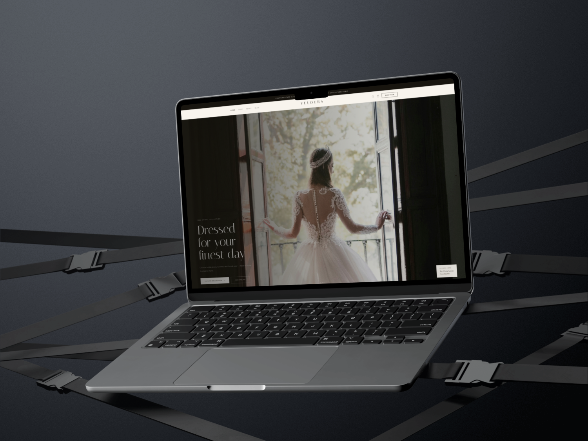
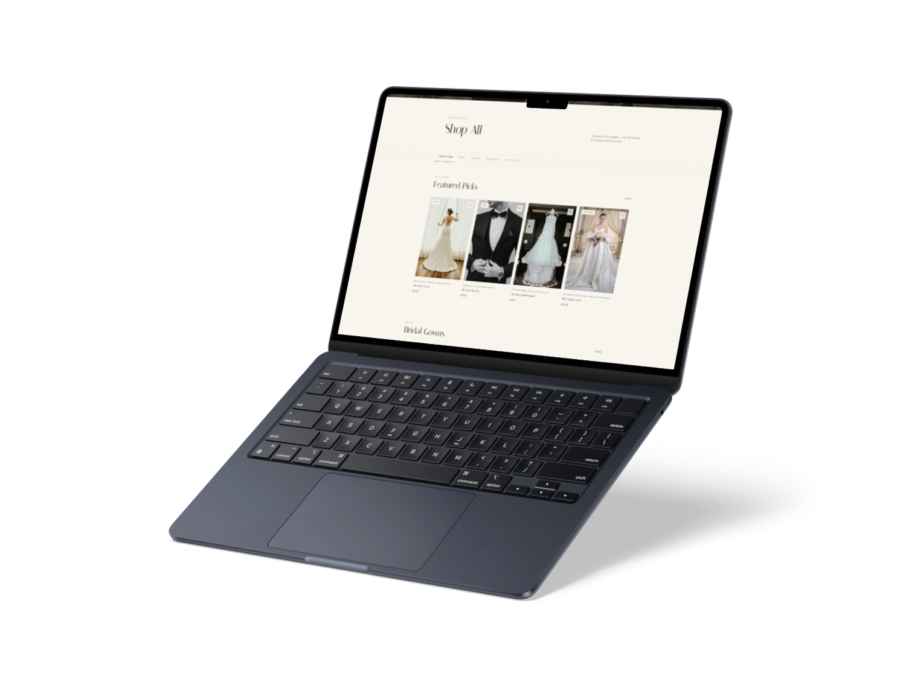
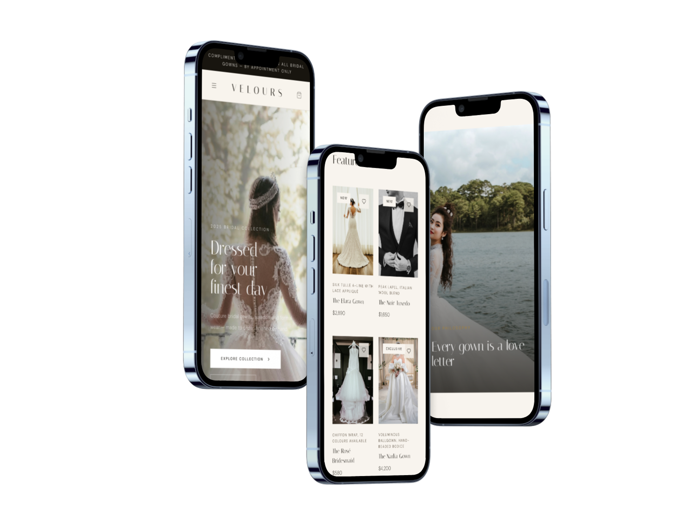

# Velours

A luxury bridal and formalwear landing page inspired by modern couture fashion brands.

## Features

- Responsive layout
- Hero section
- Featured collections
- Benefits section
- Journal / Articles section
- Appointment CTA
- Newsletter signup validation
- Scroll fade-in animations
- Mobile navigation menu

## Built With

- HTML5
- CSS3
- JavaScript (Vanilla JS)

## What I Learned

- Responsive layouts with Flexbox and Grid
- Structuring larger HTML projects
- CSS animations and transitions
- DOM selection and event listeners
- Form validation
- Scroll-based animations
- Debugging JavaScript errors

## Future Improvements

- React conversion
- Backend newsletter integration
- Appointment booking system
- Dark mode
- CMS-powered journal articles

## Mockups

## Live Demo

[Velours live page](https://velours-eight.vercel.app)

## Author

Francois le Roux
